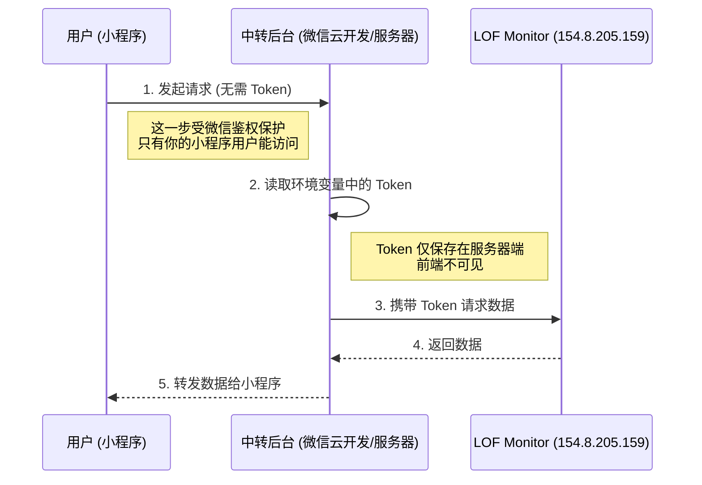

# 小程序安全集成指南 (Plan B)

> 版本：1.0
> 更新时间：2026-02-01
> 目的：指导如何通过后端中转方式安全调用 LOF Monitor API，防止 Token 泄露。

## 1. 为什么不能直接调用？

❌ **不安全做法**：在小程序前端代码中直接请求 LOF Monitor 接口。

```javascript
// 危险代码示例！
wx.request({
  url: 'http://154.8.205.159:8081/api/lof/list',
  header: {
    // 危险：Token 被硬编码在前端，任何人都可以通过抓包或反编译获取
    'Authorization': 'Bearer YOUR_SECRET_TOKEN' 
  }
})
```

一旦 `YOUR_SECRET_TOKEN` 泄露，黑客可以直接调用接口抓取此时的数据，甚至消耗服务器资源。

## 2. 推荐架构：后端中转

✅ **安全做法**：小程序请求微信云函数（或你自己的服务器），由云函数代为请求 LOF Monitor。

**架构图**：



## 3. 实现指南 (以微信云开发为例)

以下代码展示了如何在微信小程序云开发环境中实现这一方案。

### 3.1 步骤一：创建云函数

在微信开发者工具中新建这云函数，命名为 `getLofData`。

### 3.2 步骤二：编写云函数代码 (`index.js`)

```javascript
// cloudfunctions/getLofData/index.js
const cloud = require('wx-server-sdk')
const axios = require('axios') // 需要 npm install axios

cloud.init()

// 建议将 Token 配置在云函数的环境变量中，而非直接写在代码里
// 在云开发控制台 -> 设置 -> 全局设置 -> 环境变量 中添加 LOF_API_TOKEN
const API_TOKEN = process.env.LOF_API_TOKEN || '配置在环境变量中的Token'
const API_BASE_URL = 'http://154.8.205.159:8081'

exports.main = async (event, context) => {
  const wxContext = cloud.getWXContext()
  
  // 1. (可选) 鉴权：确认请求来自合法用户
  // if (!wxContext.OPENID) { ... }

  try {
    // 2. 接收小程序传来的参数
    // event.min_premium: 最小溢价率
    // event.limit: 返回条数限制
    const minPremium = event.min_premium || 0
    const limit = event.limit || 20

    // 3. 向 LOF Monitor 发起请求 (带上 Token)
    const response = await axios({
      method: 'get',
      url: `${API_BASE_URL}/api/lof/list`,
      params: {
        min_premium: minPremium
      },
      headers: {
        'Authorization': `Bearer ${API_TOKEN}`,
        'Content-Type': 'application/json'
      },
      timeout: 5000 // 5秒超时
    })

    // 4. 处理数据并返回
    // 这里可以对数据做二次处理，比如只返回小程序需要的字段，减少流量
    if (response.data.code === 0) {
      return {
        success: true,
        data: response.data.data
      }
    } else {
      return {
        success: false,
        msg: 'Server API Error',
        origin_msg: response.data.message
      }
    }

  } catch (error) {
    console.error('Request failed:', error)
    return {
      success: false,
      msg: 'Network Error',
      error: error.message
    }
  }
}
```

### 3.3 步骤三：小程序端调用

在小程序前端页面（`.js` 文件）中调用云函数：

```javascript
// pages/index/index.js
Page({
  onLoad: function() {
    this.fetchData()
  },

  fetchData: function() {
    wx.cloud.callFunction({
      name: 'getLofData',
      data: {
        min_premium: 2.0 // 可选参数：筛选溢价率 > 2%
      },
      success: res => {
        const result = res.result
        if (result.success) {
          console.log('获取数据成功:', result.data)
          this.setData({
            lofList: result.data.items,
            updateTime: result.data.update_time
          })
        } else {
          wx.showToast({ title: '获取失败', icon: 'none' })
        }
      },
      fail: err => {
        console.error('云函数调用失败', err)
      }
    })
  }
})
```

## 4. 方案优势

1.  **Token 隐形**：`API_TOKEN` 永远不出服务器/云函数，黑客无法获取。
2.  **访问控制**：
    *   LOF Monitor 只需要向公网暴露，理论上只有知道 Token 的人能访问。
    *   你的云函数 IP 是相对固定的（虽然微信云函数 IP 可能会变，但它是受控环境）。
    *   你可以轻松地在云函数里加逻辑，比如“每个用户每分钟只能刷新 5 次”，防止被恶意刷接口。
3.  **数据清洗**：LOF Monitor 返回的原始数据可能字段很多，云函数可以只返回小程序展示需要的 3-4 个字段，节省用户流量。
